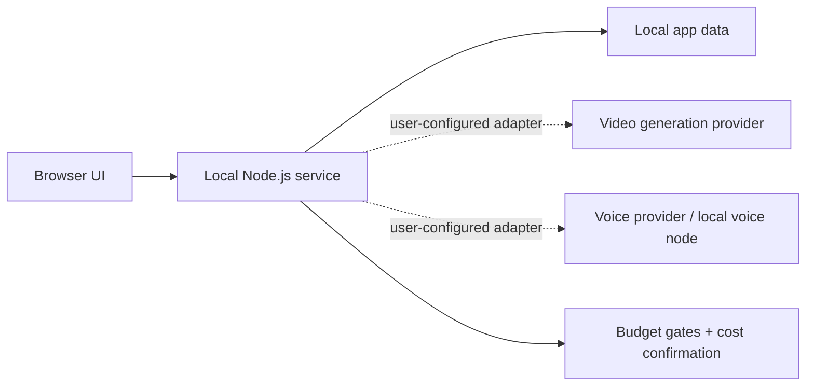

<div align="center">

# 造人局 · Digital Human Studio

**把短剧剧本交给 LLM 导演拆镜，逐镜生成数字人口播与剧情画面——一个本机优先、费用可控的桌面工作台。**

[](https://github.com/francoeur003/digital-human-studio/actions/workflows/ci.yml)
[](LICENSE)
[](https://nodejs.org/)

</div>


## 它解决什么

AI 短剧的麻烦往往不在某一个模型，而在剧本、分镜、角色形象、音色、预算确认和逐镜任务状态散落在不同地方。Digital Human Studio 把这些步骤收进一个桌面界面，用 LLM 把剧本拆成分镜表，再逐镜生成画面，同时将真实密钥、本地节点和个人素材留在你的电脑上。

## 功能亮点

### 单集生产线（M1–M6）

- LLM 编排流水线：剧本分析、导演分镜、首帧提示词、文本审核四个阶段，可从失败阶段断点续跑。
- 分镜表：每镜的镜头类型、运镜、台词、情绪与时长，支持逐镜编辑与换抽。
- 角色资产卡：给每个角色绑定数字人形象与本地/自定义音色，跨镜保持一致。
- 双引擎逐镜生成：台词镜走 Seedance 数字人口播，纯画面镜走本机 ComfyUI 图生视频。
- 两道费用闸门：先确认剧集级预算（Gate A）再生成首帧，首帧全部确认（Gate B）才放行视频；改台词或时长会使确认失效。
- 首帧使用本机算力（¥0），真实付费生成前强制确认，失败不会自动付费重试。
- 剧集与版本：多集归入剧集共享资产库；版本快照存/列/回滚。

### 平台级通用模块（M7）

- 提示词库：多模板存储 + 项目选用，内置默认模板只读逐段回退，切换不追溯已生成内容。
- 素材库：图片/音频/视频上传（魔数校验 + 大小限 + 索引自愈），资产卡参考图/配音引用记录。
- 模型管理：LLM/ComfyUI/Seedance/配音/FFmpeg 五区块只读状态总览，密钥永不返回明文。

### 素材引用注入生成（M8）

- 参考图作 ControlNet 参考条件注入 Flux 首帧；模型未装自动降级纯文本。
- 参考音频作 TTS voice clone 参考（ElevenLabs similarity_boost 提升）。
- 素材缺失静默回退不阻断生成。

### 多模型后端编排（M9）

- 项目级 providerOverrides 覆盖 env 默认（LLM + 配音 ElevenLabs），运行期切换不重启。
- 密钥本机文件存、API 永不返回明文；前端输入框 type=password 不回显。

### 批量队列（M10）

- 按类型可配置并发度的内存队列：ComfyUI（首帧+视频）、配音 TTS、FFmpeg 合成各自限流。
- 项目内一键全跑（全部首帧 / 全部视频）；队列状态实时可见。
- LLM 编排阶段不限并发（云端瓶颈不在本机）。

### 成片导出发布（M11）

- compose 成功后自动生成封面图（首镜首帧）+ 元数据 JSON（项目信息快照）。
- 一键 ZIP 打包（mp4+srt+封面+元数据），手写 store 模式零依赖。

### 剧本智能辅助（M12）

- 独立建议层：剧情结构（节奏/转折/冲突）、角色弧光（成长线/工具人）、台词润色（生硬/重复/口语化）三类。
- 分析后自动触发 + 手动刷新；只展示建议文本不自动改剧本，零污染 analysis 结构。

### 隐私纪律（贯穿全部）

- 默认展示脱敏演示数据，不含 API Key、Token、节点地址、个人路径或历史任务。
- 密钥永不入响应体明文，只出布尔「已配置」语义。

<table>
  <tr>
    <td width="50%"></td>
    <td width="50%"></td>
  </tr>
  <tr>
    <td align="center">脚本、节奏与可编辑生成提示词</td>
    <td align="center">形象预览、字幕安全区与成片参数</td>
  </tr>
</table>

## 快速开始

```bash
git clone https://github.com/yunper-wang/digital-human-studio.git
cd digital-human-studio
npm install
npm start
```

浏览器打开 `http://127.0.0.1:4199`。

也可以只启动本地 Web 版：

```bash
npm start
```

然后打开 `http://127.0.0.1:4199`。没有配置任何外部服务时，短剧界面会进入本机演示编排（mock），不产生任何费用。

## 需要接入什么

| 能力 | 接口 | 要求 |
| --- | --- | --- |
| 口播镜视频 | Seedance 2.0 生成权限与本机适配器 | 含口播镜时必需 |
| 剧情镜首帧 / 视频 | 本机 ComfyUI（Flux 首帧 + 图生视频模板） | 可选，首帧免费 |
| 短剧编排模型 | OpenAI 兼容端点（`DRAMA_LLM_*`） | 可选，缺省走本机演示编排 |
| 云端配音 | ElevenLabs API Key | 可选（口播镜音色参考） |
| 火山语音 | Doubao-Seed-TTS 2.0 / 声音复刻 2.0 | 可选（口播镜音色参考） |
| 本地克隆音色 | Voicebox + Qwen3-TTS 1.7B，支持自动检测 | 可选、免费 |

点击软件左下角的“接入说明”，或点击顶部任一供应商状态，即可看到实时连接状态并一键复制接入清单。程序还提供只读的 `GET /api/integrations`，仅返回配置项名称和脱敏状态。完整约定见 [接入说明与公开接口](docs/INTEGRATION-CONTRACT.md)。

官方入口：[项目官网](https://francoeur003.github.io/digital-human-studio/) · [火山语音官方开通](https://www.volcengine.com/products/Audio-editing-and-sound-processing) · [声音复刻 2.0 购买指南](https://www.volcengine.com/docs/6561/1167802?lang=zh) · [Voicebox 官方下载](https://voicebox.sh/download)


## 私密配置

仓库只提供空白的 [`.env.example`](.env.example)。开发模式可复制为 `.env`，桌面版则从系统应用数据目录读取 `.env`。真实人物/音色目录分别放在：

```text
config/avatars.json
config/local-voices.json
```

这些文件、`.env`、上传素材、生成结果和任务历史都被 `.gitignore` 强制排除。详见 [安全边界](docs/SECURITY-BOUNDARY.md)。

## 验收

```bash
npm test       # 语法检查 + 无费用烟雾测试
npm start      # 启动本地服务
```

纯 Web B/S 架构：`npm start` 启动 Node 服务，浏览器访问 `http://127.0.0.1:4199`。无桌面客户端依赖。

## 架构



更多细节见 [架构说明](docs/ARCHITECTURE.md)。

## 项目状态

这是一个可运行的本场优先工作台。示例形象和音色只用于界面预览，不会触发付费生成。要使用真实生成，请在你自己的本机环境中实现/配置 provider adapter。

## License

[MIT](LICENSE)
